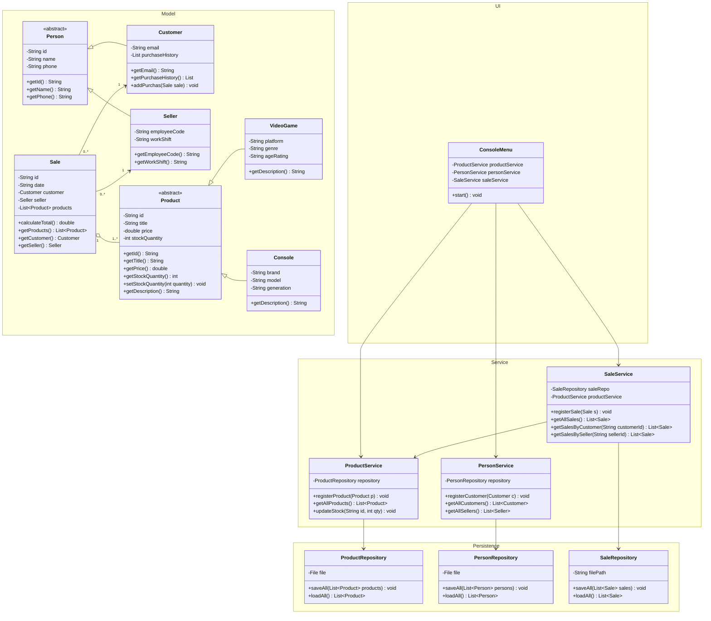

```mermaid
classDiagram
    namespace Model {
        class Person {
            <<abstract>>
            -String id
            -String name
            -String phone
            +getId() String
            +getName() String
            +getPhone() String
        }

        class Customer {
            -String email
            -List<Sale> purchaseHistory
            +getEmail() String
            +getPurchaseHistory() List<Sale>
            +addPurchas(Sale sale) void
        }

        class Seller {
            -String employeeCode
            -String workShift
            +getEmployeeCode() String
            +getWorkShift() String
        }

        class Product {
            <<abstract>>
            -String id
            -String title
            -double price
            -int stockQuantity
            +getId() String
            +getTitle() String
            +getPrice() double
            +getStockQuantity() int
            +setStockQuantity(int quantity) void
            +getDescription() String
        }

        class VideoGame {
            -String platform
            -String genre
            -String ageRating
            +getDescription() String
        }

        class Console {
            -String brand
            -String model
            -String generation
            +getDescription() String
        }

        class Sale {
            -String id
            -String date
            -Customer customer
            -Seller seller
            -List~Product~ products
            +calculateTotal() double
            +getProducts() List~Product~
            +getCustomer() Customer
            +getSeller() Seller
        }
    }

    Person <|-- Customer
    Person <|-- Seller
    Product <|-- VideoGame
    Product <|-- Console

    Sale "0..*" --> "1" Customer
    Sale "0..*" --> "1" Seller
    Sale "1" o-- "1..*" Product

    namespace Service {
        class ProductService {
            -ProductRepository repository
            +registerProduct(Product p) void
            +getAllProducts() List~Product~
            +updateStock(String id, int qty) void
        }

        class PersonService {
            -PersonRepository repository
            +registerCustomer(Customer c) void
            +getAllCustomers() List~Customer~
            +getAllSellers() List~Seller~
        }

        class SaleService {
            -SaleRepository saleRepo
            -ProductService productService
            +registerSale(Sale s) void
            +getAllSales() List~Sale~
            +getSalesByCustomer(String customerId) List~Sale~
            +getSalesBySeller(String sellerId) List~Sale~
        }
    }

    namespace Persistence {
        class ProductRepository {
            -File file
            +saveAll(List~Product~ products) void
            +loadAll() List~Product~
        }

        class PersonRepository {
            -File file
            +saveAll(List~Person~ persons) void
            +loadAll() List~Person~
        }

        class SaleRepository {
            -String filePath
            +saveAll(List~Sale~ sales) void
            +loadAll() List~Sale~
        }
    }

    namespace UI {
        class ConsoleMenu {
            -ProductService productService
            -PersonService personService
            -SaleService saleService
            +start() void
        }
    }

    ProductService --> ProductRepository
    PersonService --> PersonRepository
    SaleService --> SaleRepository
    SaleService --> ProductService
    ConsoleMenu --> ProductService
    ConsoleMenu --> PersonService
    ConsoleMenu --> SaleService
```
