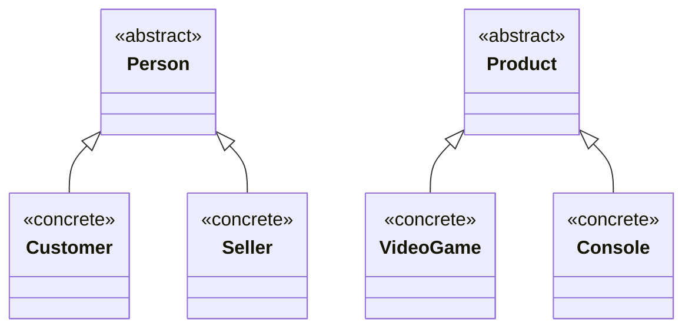

```mermaid
classDiagram
    class Person {
        <<abstract>>
    }
    class Customer {
        <<concrete>>
    }
    class Seller {
        <<concrete>>
    }

    class Product {
        <<abstract>>
    }
    class VideoGame {
        <<concrete>>
    }
    class Console {
        <<concrete>>
    }

    Person <|-- Customer
    Person <|-- Seller

    Product <|-- VideoGame
    Product <|-- Console
```
