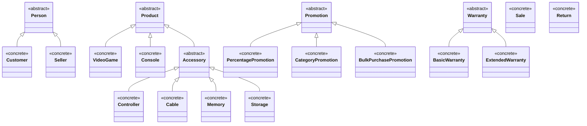

```mermaid
classDiagram
    class Person {
        <<abstract>>
    }
    class Customer {
        <<concrete>>
    }
    class Seller {
        <<concrete>>
    }

    class Product {
        <<abstract>>
    }
    class VideoGame {
        <<concrete>>
    }
    class Console {
        <<concrete>>
    }
    class Accessory {
        <<abstract>>
    }
    class Controller {
        <<concrete>>
    }
    class Cable {
        <<concrete>>
    }
    class Memory {
        <<concrete>>
    }
    class Storage {
        <<concrete>>
    }

    class Promotion {
        <<abstract>>
    }
    class PercentagePromotion {
        <<concrete>>
    }
    class CategoryPromotion {
        <<concrete>>
    }
    class BulkPurchasePromotion {
        <<concrete>>
    }

    class Warranty {
        <<abstract>>
    }
    class BasicWarranty {
        <<concrete>>
    }
    class ExtendedWarranty {
        <<concrete>>
    }

    class Sale {
        <<concrete>>
    }
    class Return {
        <<concrete>>
    }

    Person <|-- Customer
    Person <|-- Seller

    Product <|-- VideoGame
    Product <|-- Console
    Product <|-- Accessory

    Accessory <|-- Controller
    Accessory <|-- Cable
    Accessory <|-- Memory
    Accessory <|-- Storage

    Promotion <|-- PercentagePromotion
    Promotion <|-- CategoryPromotion
    Promotion <|-- BulkPurchasePromotion

    Warranty <|-- BasicWarranty
    Warranty <|-- ExtendedWarranty
```
