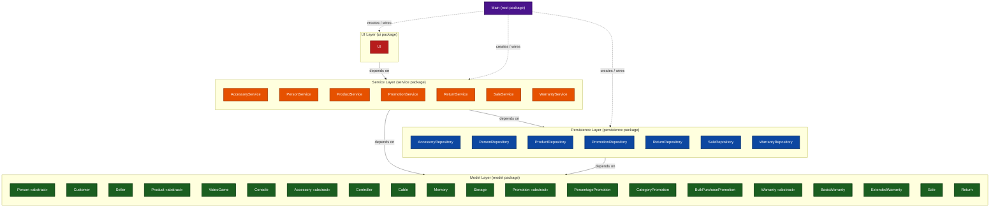

```mermaid
flowchart TB

    subgraph UI["UI Layer (ui package)"]
        direction TB
        UIClass["UI"]
    end

    subgraph SERVICE["Service Layer (service package)"]
        direction TB
        AccessoryService["AccessoryService"]
        PersonService["PersonService"]
        ProductService["ProductService"]
        PromotionService["PromotionService"]
        ReturnService["ReturnService"]
        SaleService["SaleService"]
        WarrantyService["WarrantyService"]
    end

    subgraph PERSISTENCE["Persistence Layer (persistence package)"]
        direction TB
        AccessoryRepository["AccessoryRepository"]
        PersonRepository["PersonRepository"]
        ProductRepository["ProductRepository"]
        PromotionRepository["PromotionRepository"]
        ReturnRepository["ReturnRepository"]
        SaleRepository["SaleRepository"]
        WarrantyRepository["WarrantyRepository"]
    end

    subgraph MODEL["Model Layer (model package)"]
        direction TB
        Person["Person «abstract»"]
        Customer["Customer"]
        Seller["Seller"]
        Product["Product «abstract»"]
        VideoGame["VideoGame"]
        Console["Console"]
        Accessory["Accessory «abstract»"]
        Controller["Controller"]
        Cable["Cable"]
        Memory["Memory"]
        Storage["Storage"]
        Promotion["Promotion «abstract»"]
        PercentagePromotion["PercentagePromotion"]
        CategoryPromotion["CategoryPromotion"]
        BulkPurchasePromotion["BulkPurchasePromotion"]
        Warranty["Warranty «abstract»"]
        BasicWarranty["BasicWarranty"]
        ExtendedWarranty["ExtendedWarranty"]
        Sale["Sale"]
        Return["Return"]
    end

    Main["Main (root package)"]

    UI -->|depends on| SERVICE
    SERVICE -->|depends on| PERSISTENCE
    SERVICE -->|depends on| MODEL
    PERSISTENCE -->|depends on| MODEL

    Main -.->|creates / wires| UI
    Main -.->|creates / wires| SERVICE
    Main -.->|creates / wires| PERSISTENCE

    classDef modelClass fill:#1b5e20,stroke:#0d3d13,stroke-width:2px,color:#ffffff;
    classDef persistenceClass fill:#0d47a1,stroke:#08306b,stroke-width:2px,color:#ffffff;
    classDef serviceClass fill:#e65100,stroke:#a03800,stroke-width:2px,color:#ffffff;
    classDef uiClass fill:#b71c1c,stroke:#7f1313,stroke-width:2px,color:#ffffff;
    classDef mainClass fill:#4a148c,stroke:#31095c,stroke-width:2px,color:#ffffff;

    class Person,Customer,Seller,Product,VideoGame,Console,Accessory,Controller,Cable,Memory,Storage,Promotion,PercentagePromotion,CategoryPromotion,BulkPurchasePromotion,Warranty,BasicWarranty,ExtendedWarranty,Sale,Return modelClass;
    class AccessoryRepository,PersonRepository,ProductRepository,PromotionRepository,ReturnRepository,SaleRepository,WarrantyRepository persistenceClass;
    class AccessoryService,PersonService,ProductService,PromotionService,ReturnService,SaleService,WarrantyService serviceClass;
    class UIClass,ProofUi uiClass;
    class Main mainClass;
```
